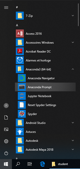
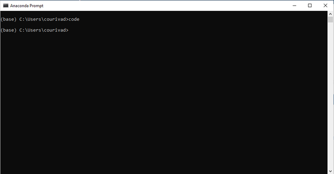
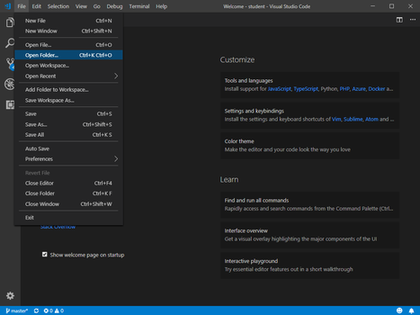
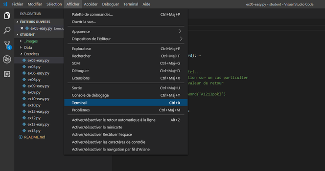
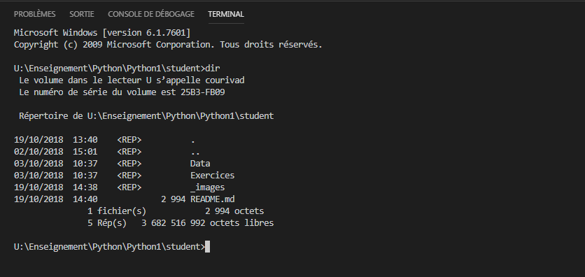
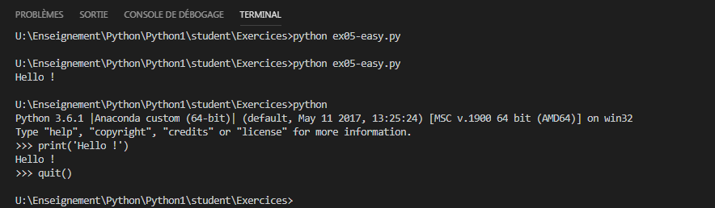

Ce projet contient les ressources nécessaires pour suivre [le cours Python](https://perso.esiee.fr/~courivad/Python/index.html) et faire les exercices associés.

# Le contexte général
Pour faciliter le développement du code informatique, il est important (entre autres) de disposer :

- d’un endroit centralisé hébergeant le travail déjà réalisé
- d’un système de versionnage permettant d’archiver différentes étapes du travail

Dans le cadre de ce cours nous utiliserons le système [git](https://fr.wikipedia.org/wiki/Git). Pour une présentation (un peu) approfondie, on peut utiliser [le tutoriel OpenClassrooms](https://openclassrooms.com/fr/courses/1233741-gerez-vos-codes-source-avec-git).

# Le contexte ESIEE

L'ESIEE a déployé un serveur GitLab et vous disposez d'un compte sur la plateforme https://git.esiee.fr/. La connexion se fait avec vos identifiants habituels.

Les machines de l'ESIEE disposent du système [git](https://fr.wikipedia.org/wiki/Git). On travaillera dans l'environnement Windows.

# Obtenir les ressources

Ce dépôt (https://git.esiee.fr/courivad/Python) contient des informations générales sur la méthodologie de développement ainsi que les fichiers nécessaires pour le cours (les exemples utilisés et le squelette des exercices d’application).

## Forker le projet initial

Une fois connecté [au Git ESIEE](https://git.esiee.fr/), rechercher le projet https://git.esiee.fr/courivad/Python et le forker. Un fork est une copie complète du projet dans votre espace personnel. Par la suite, cette copie sera appelée "repo distant".  Vous pourrez ultérieurement ajouter, supprimer ou modifier du contenu.

## Cloner le projet sur une machine locale

Sur une machine locale, on clone le projet à partir du repo distant avant de poursuivre le travail de développement. Cloner un projet c'est créer un répertoire local contenant les fichiers du repo distant. 

- sous Windows, lancez la commande `Git Bash`, qui ouvre un terminal configuré pour fonctionner avec `git`. Sous Linux, le terminal standard est configuré pour fonctionner directement avec `git`.
- placez vous dans votre répertoire réseau. Sous Windows, il s'agit du disque U: : `cd /u`
- clonez le projet : `git clone https://git.esiee.fr/<YOUR_GIT_NAME>/Python`
  
Tout au long du cours vous pouvez être amenés à utiliser plusieurs machines de développement (des machines différentes dans les salles de l’ESIEE, votre machine personnelle, etc...). Si vous maintenez la synchronisation entre repo distant et repo local, vous pourrez à tout moment cloner le projet (à jour) sur une ou plusieurs machines locales. utilisée.

## Les ressources

Le dossier `Python` cloné à l'étape précédente, contient l'ensemble des ressources nécessaires pour suivre ce cours.

* Le dossier `Data` contient les données utilisées pour les exemples du cours et celles nécessaires pour faire certains exercices.
* Le dossier `Exercices` contient des squelettes de fichier pour faire certains exercices. En deux versions:
    * la version "normale" ne contient que la signature des fonctions et les doctests associés
    * la version "easy" contient des informations supplémentaires sur la structuration du problème

Le découpage en séances est donné ci dessous à titre indicatif dans la section [Agenda](#agenda)

# Méthodologie de développement

## Coder

Le travail de développement se fait sur une machine locale (dans le répertoire `Python` créé lors de l'opération de clonage) avec un terminal (Anaconda Prompt) et un éditeur de texte ([Visual Studio Code](https://code.visualstudio.com/download)).

Nous allons travailler dans l'environnement Anaconda. Il est installé sur les machines Windows de l'ESIEE et disponible au téléchargement [ici](https://www.anaconda.com/download/) pour vos machines personnelles.

### Démarrer un terminal Anaconda Prompt

### Lancer Visual Studio Code

Dans ce terminal, la commande `code` permet de lancer l'éditeur de texte [Visual Studio Code](https://code.visualstudio.com/download). 

### Ouvrir le répertoire de travail

Ouvrir le dossier `Python` qui contient les ressources nécessaires pour ce cours avec la commande `Open Folder...`. Au démarrage, ce répertoire est un clone du projet  https://git.esiee.fr/courivad/Python. Il contiendra par la suite le travail réalisé dans le cadre de ce cours. Vous pouvez utiliser `git`, également intégré à Visual Studio Code, pour maintenir la synchronisation entre votre répertoire et le repo distant.

### Le terminal intégré

Visual Studio Code dispose d'un terminal intégré, que l'on fait apparaître ou disparaître dans le menu Afficher.

Ce terminal fonctionne de la même manière que le terminal ouvert par la commande `Anaconda Prompt`. Toutes les commandes Windows sont disponibles. Toutes les variables d'environnement ont été initialisées pour permettre l'utilisation de l'environnement Anaconda.

Ce terminal intégré permet :

- d'exécuter les programmes Python avec la syntaxe `python nom_du_programme.py` 
- et de lancer l'interpréteur interactif avec la syntaxe `python` . Le prompt (l'invite de commande) de ce dernier est différent (`>>>`) et permet d'identifier la nature des commandes attendues. 
  
Une erreur courante est d'entrer des commandes Python dans un terminal Windows ou l'inverse, des commandes Windows dans un interpréteur Python.

## Synchroniser son travail avec le repo distant

Il est utile de garder synchronisés le répertoire local et le repo distant. 

- au début de chaque nouvelle séance, on récupére les modifications depuis le repo distant : `git pull`
- à la fin de chaque nouvelle séance
    - on ajoute les fichiers du répertoire à l'index : `git add .`
    - on enregistre les modifications dans le repo local : `git commit -m "Travail effectué lors de la première séance"`. L'idée générale est de faire un commit à chaque étape logique du travail. Par exemple à la fin de chaque séance de TP...
    - on pousse les modifications de la machine locale vers le repo distant : `git push origin master`
